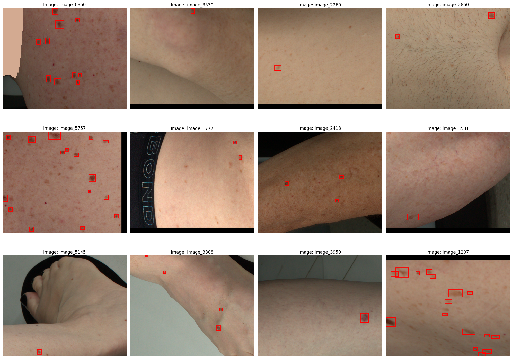

# iToBoS 2024 - Skin Lesion Detection with 3D-TBP

Official repository for the iToBoS skin lesion detection challenge dataset utilizing Total Body Photography (TBP) imaging.

## Overview

The iToBoS challenge provides a comprehensive benchmark for evaluating skin lesion detection algorithms using advanced 3D Total Body Photography. This repository contains the dataset, evaluation tools, and helper scripts necessary for training and testing models.

## Table of Contents

- [Features](#features)
- [Directory Structure](#directory-structure)
- [Installation](#installation)
- [Dataset](#dataset)
- [Samples from Dataset](#samples-from-dataset)
- [Helper Scripts](#helper-scripts)
- [Usage Examples](#usage-examples)
- [Contributing](#contributing)
- [License](#license)

## Features

- Complete skin lesion detection dataset with annotations
- YOLO and COCO format support
- Conversion utilities between annotation formats
- Visualization tools for annotations
- Statistical analysis notebooks
- Evaluation scripts for model performance

## Directory Structure

```
iToBoS-Challenge/
├── dataset/                     # Dataset root directory
│   ├── train/                  # Training dataset
│   │   ├── images/            # Training images
│   │   └── labels/            # Training annotations
│   ├── test/                  # Test dataset
│   │   ├── images/            # Test images
│   │   └── labels/            # Test annotations
│   └── additional_data/       # Supplementary data
│
├── helpers/                    # Utility scripts
│   ├── coco_to_yolo.py        # COCO to YOLO format converter
│   ├── yolo_to_coco.py        # YOLO to COCO format converter
│   ├── statistics.ipynb       # Dataset analysis notebook
│   ├── visualize_annotation.py # Annotation visualization tool
│   └── yolo_eval.py           # YOLO evaluation script
│
├── docs/                      # Documentation
├── requirements.txt           # Python dependencies
├── LICENSE                    # License information
└── README.md                  # Project documentation
```

## Installation

1. Clone the repository:
```bash
git clone https://github.com/yourusername/iToBoS-Challenge.git
cd iToBoS-Challenge
```

2. Create a virtual environment (recommended):
```bash
python -m venv venv
source venv/bin/activate  # On Windows: venv\Scripts\activate
```

3. Install dependencies:
```bash
pip install -r requirements.txt
```

## Dataset

The dataset is organized into training and testing sets, each containing:
- High-resolution skin images
- Lesion annotations in YOLO format
- Additional metadata about imaging conditions

### Dataset Statistics
- Training images: 7000
- Test images: 7000
- Lesion classes: [0 : unlabeled]
- Average lesions per image: W


## Samples from Dataset



## Helper Scripts

The `helpers` directory contains various utility scripts:

1. **Format Conversion**
   - `coco_to_yolo.py`: Converts COCO format annotations to YOLO
   - `yolo_to_coco.py`: Converts YOLO format annotations to COCO

2. **Analysis Tools**
   - `statistics.ipynb`: Jupyter notebook for dataset analysis
   - `visualize_annotation.py`: Tool for visualizing annotations
   - `yolo_eval.py`: Evaluation script for YOLO format predictions

## Usage Examples

### Converting Annotations
```bash
# YOLO to COCO conversion
python helpers/yolo_to_coco.py --input path/to/yolo --output path/to/coco

# COCO to YOLO conversion
python helpers/coco_to_yolo.py --input path/to/coco --output path/to/yolo
```

### Visualizing Annotations
```bash
python helpers/visualize_annotation.py --image path/to/image --label path/to/label
```

### Running Evaluation
```bash
python helpers/yolo_eval.py --pred path/to/predictions --gt path/to/ground_truth
```

<!-- ## Contributing

We welcome contributions! Please follow these steps:

1. Fork the repository
2. Create a feature branch (`git checkout -b feature/amazing-feature`)
3. Commit your changes (`git commit -m 'Add amazing feature'`)
4. Push to the branch (`git push origin feature/amazing-feature`)
5. Open a Pull Request -->

## License

This project is licensed under the MIT License - see the [LICENSE](LICENSE) file for details.

## Acknowledgments

- iToBoS Project Team
- Contributing Research Institutions
- Dataset Contributors
